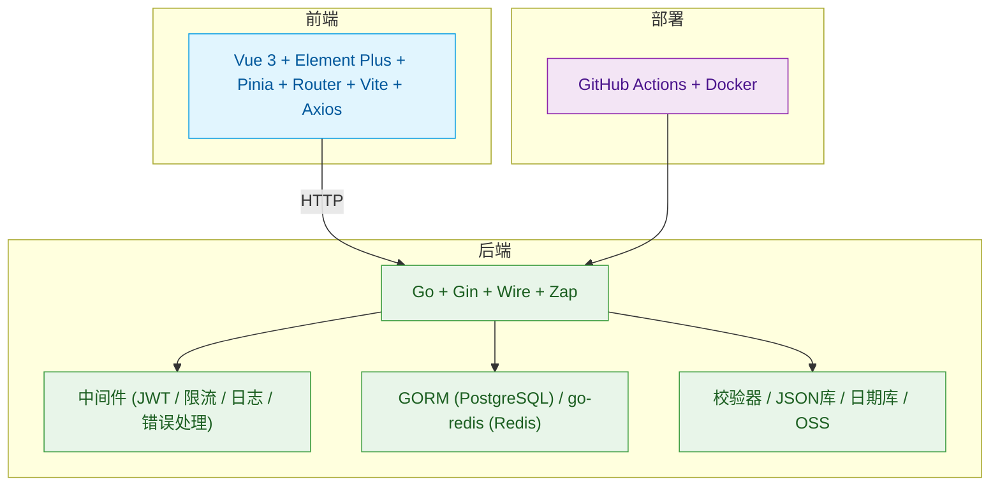

# Art-Design-Pro个人后端项目

[前端项目地址](https://github.com/Daymychen/art-design-pro)

# 项目结构

```shell
.
├── cmd/                        # 应用程序入口
│   └── app/
│       ├── main.go            # 主程序入口
│       ├── run_server.go      # 启动服务逻辑
│       ├── wire.go            # Wire 注入定义
│       └── wire_gen.go        # Wire 自动生成文件（勿手动修改）
├── config/                    # 配置加载与初始化
│   ├── config.go              # 全局配置结构定义
├── internal/                  # 内部应用逻辑（核心业务）
│   ├── bootstrap/             # 各模块初始化
│   ├── controller/            # 控制器（HTTP 接口）
│   ├── model/                 # 数据模型（Entity、Request、Response）
│   ├── repository/            # 数据访问层
│   └── service/               # 业务逻辑层
├── pkg/                       # 可复用的独立工具库
│   ├── aliyun/oss_client.go   # OSS 客户端封装
│   ├── authutils/             # 认证辅助函数
│   ├── client/                # 外部服务客户端
│   ├── constant/              # 常量定义（Redis Key、表名等）
│   ├── container/             # 并发工具等封装
│   ├── errors/                # 错误定义与分类
│   ├── jwt/                   # JWT 工具
│   ├── middleware/            # Gin 中间件集合
│   ├── redisx/                # Redis 操作封装
│   ├── result/                # 通用返回结构
│   └── utils/                 # 工具函数库
├── scripts/                   # 脚本工具（如构建脚本）
│   └── build.sh               # 构建脚本
├── Dockerfile                # Docker 构建配置
├── go.mod / go.sum           # Go Modules 依赖
├── LICENSE                   # 授权协议
├── README.md                 # 项目说明
├── commitlint.config.js      # Git 提交规范配置
├── package.json              # husky相关依赖
```

# 完整技术栈



# 注意事项

运行前记得生成依赖注入的wire代码

```shell
go get -u ./... && go mod tidy && go tool github.com/google/wire/cmd/wire ./...
```

