# Art-Design-Pro个人后端项目

[前端项目地址](https://github.com/Daymychen/art-design-pro)

# 项目结构

```shell
.
├── LICENSE                         # 开源许可文件
├── README.md                       # 项目说明文档
├── build.sh                        # 构建或部署脚本
├── cmd                             # 主程序入口目录
│   └── app                         # 启动应用的 main 函数等入口代码
├── commitlint.config.js           # commitlint 配置文件（校验 Git 提交信息）
├── config                          # 应用初始化配置（如数据库、Redis、日志等初始化逻辑）
├── configs                         # 配置文件目录（如 YAML 格式的配置信息）
├── go.mod                          # Go 依赖管理文件
├── go.sum                          # Go 依赖的完整校验和
├── internal                        # 核心业务逻辑（controller、service、repository、model 等）
│   ├── controller                 # 路由控制层（处理 HTTP 请求）
│   ├── model                      # 数据模型定义（Entity、Request、Response、Query 等）
│   ├── repository                 # 数据访问层（对数据库的操作）
│   └── service                    # 服务层（处理业务逻辑）
├── package.json                   # Node 项目配置（用于前端工具 Git 钩子，Husky、Commitlint）
├── pkg                             # 通用库模块（可复用的工具库或封装组件）
│   ├── aliyun                    # 阿里云 OSS 客户端封装
│   ├── authutils                 # 权限认证相关工具
│   ├── client                    # 外部服务客户端（如推理服务）
│   ├── constant                  # 常量定义（如 Redis key、表名等）
│   ├── container                 # 并发安全的容器封装
│   ├── errors                    # 错误类型定义
│   ├── jwt                       # JWT 生成与验证
│   ├── middleware                # Gin 中间件（如认证、限流、日志记录等）
│   ├── redisx                    # Redis 操作封装（支持 Lua、集合、缓存等功能）
│   ├── result                    # 通用响应格式封装
│   └── utils                     # 常用工具方法（如 UUID、时间解析等）
```

# 完整技术栈

```mermaid
graph TD
    %% 全局样式
    classDef frontend fill:#e1f5fe,stroke:#039be5,color:#01579b;
    classDef backend fill:#e8f5e9,stroke:#43a047,color:#1b5e20;
    classDef deploy fill:#f3e5f5,stroke:#8e24aa,color:#4a148c;
    classDef db fill:#fff3e0,stroke:#fb8c00,color:#e65100;

    %% 前端
    subgraph 前端技术栈
        direction LR
        Vue3["Vue 3 (vue)"] --> ElementPlus["Element Plus (element-plus)"]
        Vue3 --> Pinia["Pinia (pinia)"]
        Vue3 --> VueRouter["Vue Router (vue-router)"]
        Vue3 --> Vite["Vite (vite)"]
        Vite --> Axios["Axios (axios)"]
        class Vue3,Vite,Axios,ElementPlus,VueRouter,Pinia frontend
    end

    %% 后端核心
    subgraph 后端核心
        direction LR
        Go["Go 1.24 (language)"] --> Gin["Gin (github.com/gin-gonic/gin)"]
        Gin --> Wire["Wire (github.com/google/wire)"]
        Gin --> Zap["Zap (go.uber.org/zap)"]
        class Go,Gin,Wire,Zap backend
    end

    %% 业务架构
    subgraph 业务分层
        direction LR
        Controllers["控制器 (internal/controller)"] --> Services["服务层 (无单独provider)"]
        Services --> Repositories["仓储 (internal/repository)"]
        class Controllers,Services,Repositories backend
    end

    %% 中间件
    subgraph 中间件
        direction LR
        Middleware["中间件管理器 (pkg/middleware)"] --> Auth["JWT (github.com/golang-jwt/jwt/v5)"]
        Middleware --> RateLimiter["限流器 (基于滑动窗口算法)"]
        Middleware --> ErrorHandler["错误处理 (统一封装)"]
        Middleware --> OpLog["操作日志 (zap-based)"]
        class Middleware,ErrorHandler,Auth,RateLimiter,OpLog backend
    end

    %% 存储系统
    subgraph 数据存储
        direction TB
        PostgreSQL["PostgreSQL (v17)"] --> GORM["GORM (gorm.io/gorm)"]
        Redis["Redis (v7)"] --> GoRedis["go-redis (github.com/redis/go-redis/v9)"]
        class PostgreSQL,Redis db
        class GORM,GoRedis backend
    end

    %% 基础设施
    subgraph 基础设施
        direction LR
        OSS["OSS SDK (github.com/aliyun/alibabacloud-oss-go-sdk-v2)"]
        Validator["校验器 (github.com/go-playground/validator/v10)"]
        Sonic["JSON库 (github.com/bytedance/sonic)"]
        Carbon["日期库 (github.com/dromara/carbon/v2)"]
        class OSS,Validator,Sonic,Carbon backend
    end

    %% DevOps
    subgraph CI/CD & 部署
        direction LR
        CI["GitHub Actions (.github/workflows)"] --> Docker["Docker (容器部署)"]
        class CI,Docker deploy
    end

    %% 连接关系
    Vue3 -->|HTTP| Gin
    Gin --> Middleware
    Controllers --> Middleware
    Controllers --> Services
    Services --> Repositories
    Repositories --> GORM
    Repositories --> GoRedis
    Gin --> Validator
    Gin --> OSS
    Gin --> Sonic
    Gin --> Carbon

```



# 注意事项

运行前记得生成依赖注入的wire代码

```shell
go get -u ./... && go mod tidy && go tool github.com/google/wire/cmd/wire ./...
```

