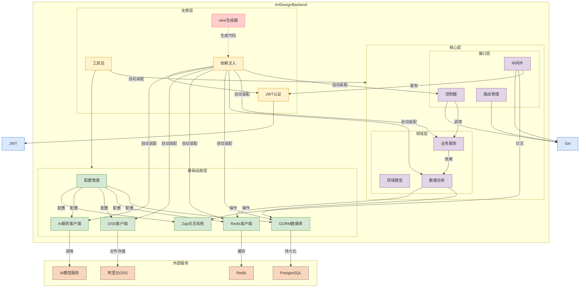

# Art-Design-Pro个人后端项目

[前端项目地址](https://github.com/Daymychen/art-design-pro)

# 项目结构

```shell
├── cmd                         # 应用程序入口目录（通常包含 main.go）
│   └── app                     # 具体的应用主程序
├── config                      # 配置加载逻辑（如初始化配置结构体等）
├── configs                     # 配置文件目录（如 .yaml、.json 等）
├── internal                    # 内部模块（按领域或功能划分）
│   ├── bootstrap               # 项目启动流程，如初始化数据库、日志、依赖注入等
│   ├── controller              # 控制器层（HTTP 接口逻辑）
│   ├── model                   # 模型定义层
│   │   ├── base                # 通用基础模型（如 BaseModel）
│   │   ├── entity              # 与数据库结构对应的实体定义
│   │   ├── query               # 查询结构体定义（用于参数组合、查询构造）
│   │   ├── request             # 接收前端请求的结构体
│   │   └── response            # 返回给前端的响应结构体
│   ├── repository              # 仓储层（数据访问逻辑）
│   │   ├── cache               # 缓存访问逻辑（通常是 Redis）
│   │   └── db                  # 数据库访问逻辑（通常是 GORM/SQL）
│   └── service                 # 服务层（业务逻辑实现）
├── pkg                         # 可复用的通用模块（第三方或自研工具）
│   ├── ai                      # AI 模块（如模型推理、调用接口）
│   ├── aliyun                 # 阿里云 SDK 封装（如短信、OSS）
│   ├── authutils               # 鉴权工具包
│   ├── constant                # 常量定义
│   │   ├── rediskey            # Redis 键名常量
│   │   └── tablename           # 表名常量
│   ├── digit_client            # 数字识别客户端（如识图接口等）
│   ├── errors                  # 自定义错误类型
│   ├── jwt                     # JWT 生成与解析
│   ├── middleware              # Gin 中间件集合
│   ├── redisx                  # Redis 封装（连接池、通用方法）
│   ├── result                  # 通用响应结构体（如统一的 Response 封装）
│   └── utils                   # 工具函数（如字符串处理、时间格式化等）
└── scripts                     # 启动脚本、部署脚本、数据库初始化等
```

# 完整技术栈



# 注意事项

运行前记得生成依赖注入的wire代码

```shell
go get -u ./... && go mod tidy && go tool github.com/google/wire/cmd/wire ./...
```


