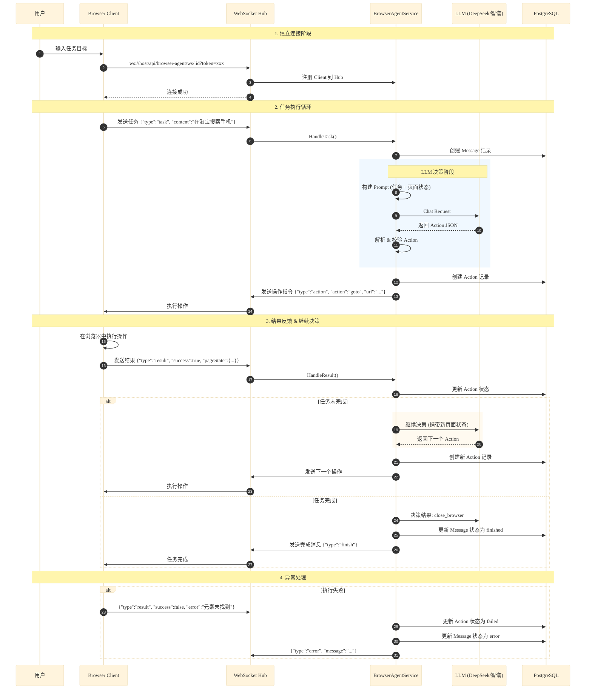
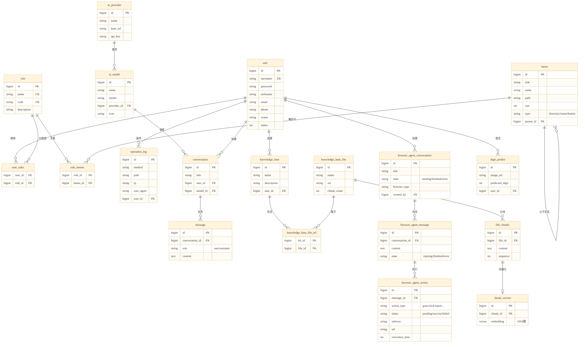
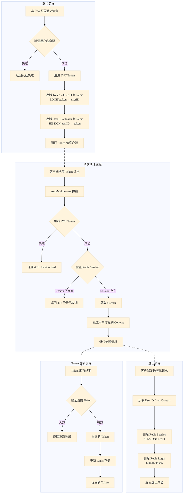
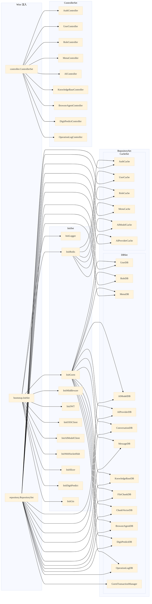

# Art-Design-Pro 个人后端项目

基于 Go 语言的企业级后端服务系统，集成**浏览器智能体（Browser Agent）**、AI 对话、知识库管理、用户权限等核心功能。

## 相关项目

| 项目 | 说明 | 地址 |
|------|------|------|
| 前端项目 | Vue3 管理后台 | [Art-Design-Frontend](https://github.com/WwhdsOne/Art-Design-Frontend) |
| 客户端项目 | 浏览器智能体客户端 | [Browser-Agent-Client](https://github.com/WwhdsOne/Browser-Agent-Client) |

## 核心功能

- **浏览器智能体 (Browser Agent)** - 基于 LLM 的智能浏览器自动化，支持自动填表、数据采集、电商搜索等
- **AI 对话** - 多模型支持、流式响应、对话历史管理
- **知识库 (RAG)** - 文档上传、智能分块、向量检索、混合搜索
- **用户管理** - RBAC 权限控制、JWT 认证、操作日志

## 技术栈

| 类别 | 技术 |
|------|------|
| 编程语言 | Go 1.26+ |
| Web 框架 | Gin |
| ORM | GORM |
| 数据库 | PostgreSQL + pgvector |
| 缓存 | Redis |
| 依赖注入 | Google Wire |
| 实时通信 | Gorilla WebSocket |
| 日志 | Zap |
| 配置中心 | Consul |
| 文件存储 | 阿里云 OSS |
| AI 服务 | 智谱 AI / DeepSeek / 通义千问 |

---

## 系统架构

### 总体架构图

```mermaid
%%{init: {'theme': 'base', 'themeVariables': { 'primaryColor': '#e3f2fd', 'primaryTextColor': '#1565c0', 'primaryBorderColor': '#1565c0', 'lineColor': '#546e7a', 'fontFamily': 'Microsoft YaHei'}}}%%
graph TB
    subgraph 客户端层
        WEB[Vue3 前端]
        CLIENT[Browser Agent Client]
    end

    subgraph 网关层
        GIN[Gin Engine]
        MW_AUTH[AuthMiddleware]
        MW_RATE[RateLimiter]
        MW_LOG[OperationLogger]
        MW_ERR[ErrorHandler]
    end

    subgraph 控制器层
        CTRL_AUTH[AuthController]
        CTRL_USER[UserController]
        CTRL_ROLE[RoleController]
        CTRL_MENU[MenuController]
        CTRL_AI[AIController]
        CTRL_KB[KnowledgeBaseController]
        CTRL_BA[BrowserAgentController]
        CTRL_WS[WebSocket Handler]
        CTRL_DP[DigitPredictController]
        CTRL_OL[OperationLogController]
    end

    subgraph 服务层
        SVC_AUTH[AuthService]
        SVC_USER[UserService]
        SVC_ROLE[RoleService]
        SVC_MENU[MenuService]
        SVC_AI[AIService]
        SVC_KB[KnowledgeBaseService]
        SVC_BA[BrowserAgentService]
        SVC_BAD[BrowserAgentDashboardService]
        SVC_DP[DigitPredictService]
        SVC_OL[OperationLogService]
    end

    subgraph 仓库层
        REPO_USER[UserRepo]
        REPO_ROLE[RoleRepo]
        REPO_MENU[MenuRepo]
        REPO_AUTH[AuthRepo]
        REPO_AI[AIModelRepo<br/>AIProviderRepo]
        REPO_CONV[ConversationRepo]
        REPO_KB[KnowledgeBaseRepo]
        REPO_BA[BrowserAgentRepo]
        REPO_DP[DigitPredictRepo]
        REPO_OL[OperationLogRepo]
    end

    subgraph 数据访问层
        DB_LAYER[GORM DB Layer]
        CACHE_LAYER[Redis Cache Layer]
    end

    subgraph 外部服务
        PG[(PostgreSQL<br/>+ pgvector)]
        REDIS[(Redis)]
        OSS[阿里云 OSS]
        AI_SVC[AI 服务<br/>智谱/DeepSeek/通义]
        CONSUL[Consul<br/>配置中心]
        SLICER[文档分片服务]
    end

    subgraph 公共组件
        JWT_PKG[jwt]
        AI_PKG[ai client]
        OSS_PKG[aliyun oss]
        WS_PKG[websocket hub]
        ERR_PKG[errors]
        RESULT_PKG[result]
    end

    %% 客户端连接
    WEB -->|HTTP/REST| GIN
    CLIENT -->|WebSocket| CTRL_WS

    %% 中间件链
    GIN --> MW_LOG
    MW_LOG --> MW_RATE
    MW_RATE --> MW_AUTH
    MW_AUTH --> MW_ERR
    MW_ERR --> CTRL_AUTH
    MW_ERR --> CTRL_USER
    MW_ERR --> CTRL_ROLE
    MW_ERR --> CTRL_MENU
    MW_ERR --> CTRL_AI
    MW_ERR --> CTRL_KB
    MW_ERR --> CTRL_BA
    MW_ERR --> CTRL_DP
    MW_ERR --> CTRL_OL

    %% 控制器到服务
    CTRL_AUTH --> SVC_AUTH
    CTRL_USER --> SVC_USER
    CTRL_ROLE --> SVC_ROLE
    CTRL_MENU --> SVC_MENU
    CTRL_AI --> SVC_AI
    CTRL_KB --> SVC_KB
    CTRL_BA --> SVC_BA
    CTRL_BA --> SVC_BAD
    CTRL_WS --> SVC_BA
    CTRL_DP --> SVC_DP
    CTRL_OL --> SVC_OL

    %% 服务到仓库
    SVC_AUTH --> REPO_USER
    SVC_AUTH --> REPO_AUTH
    SVC_USER --> REPO_USER
    SVC_USER --> REPO_ROLE
    SVC_ROLE --> REPO_ROLE
    SVC_ROLE --> REPO_MENU
    SVC_MENU --> REPO_MENU
    SVC_AI --> REPO_AI
    SVC_AI --> REPO_CONV
    SVC_KB --> REPO_KB
    SVC_BA --> REPO_BA
    SVC_BAD --> REPO_BA
    SVC_DP --> REPO_DP
    SVC_OL --> REPO_OL

    %% 仓库到数据层
    REPO_USER --> DB_LAYER
    REPO_USER --> CACHE_LAYER
    REPO_ROLE --> DB_LAYER
    REPO_ROLE --> CACHE_LAYER
    REPO_MENU --> DB_LAYER
    REPO_MENU --> CACHE_LAYER
    REPO_AUTH --> CACHE_LAYER
    REPO_AI --> DB_LAYER
    REPO_AI --> CACHE_LAYER
    REPO_CONV --> DB_LAYER
    REPO_KB --> DB_LAYER
    REPO_BA --> DB_LAYER
    REPO_DP --> DB_LAYER
    REPO_OL --> DB_LAYER

    %% 数据层到外部服务
    DB_LAYER --> PG
    CACHE_LAYER --> REDIS

    %% 公共组件使用
    SVC_AUTH --> JWT_PKG
    MW_AUTH --> JWT_PKG
    SVC_AI --> AI_PKG
    SVC_KB --> OSS_PKG
    SVC_USER --> OSS_PKG
    SVC_BA --> WS_PKG
    CTRL_WS --> WS_PKG

    %% 外部服务连接
    AI_PKG --> AI_SVC
    OSS_PKG --> OSS
    CONSUL -.->|配置| GIN
    SVC_KB --> SLICER

    classDef client fill:#fff3e0,stroke:#ef6c00
    classDef gateway fill:#e3f2fd,stroke:#1565c0
    classDef ctrl fill:#f3e5f5,stroke:#7b1fa2
    classDef svc fill:#e8f5e9,stroke:#2e7d32
    classDef repo fill:#fce4ec,stroke:#c2185b
    classDef db fill:#fff8e1,stroke:#f9a825
    classDef ext fill:#eceff1,stroke:#546e7a
    classDef pkg fill:#e0f2f1,stroke:#00695c

    class WEB,CLIENT client
    class GIN,MW_AUTH,MW_RATE,MW_LOG,MW_ERR gateway
    class CTRL_AUTH,CTRL_USER,CTRL_ROLE,CTRL_MENU,CTRL_AI,CTRL_KB,CTRL_BA,CTRL_WS,CTRL_DP,CTRL_OL ctrl
    class SVC_AUTH,SVC_USER,SVC_ROLE,SVC_MENU,SVC_AI,SVC_KB,SVC_BA,SVC_BAD,SVC_DP,SVC_OL svc
    class REPO_USER,REPO_ROLE,REPO_MENU,REPO_AUTH,REPO_AI,REPO_CONV,REPO_KB,REPO_BA,REPO_DP,REPO_OL repo
    class DB_LAYER,CACHE_LAYER db
    class PG,REDIS,OSS,AI_SVC,CONSUL,SLICER ext
    class JWT_PKG,AI_PKG,OSS_PKG,WS_PKG,ERR_PKG,RESULT_PKG pkg
```



---

### Browser Agent 工作流程图



---

### 数据库设计概要



---

### 认证流程图



---

### 模块依赖关系图



---

## 核心功能模块

### 浏览器智能体 (Browser Agent)

基于大语言模型的智能浏览器自动化系统，通过 LLM 理解用户意图，自动生成操作序列并执行。

**工作原理：**
1. 用户通过 WebSocket 连接并发送任务目标
2. 服务端调用 LLM（DeepSeek/智谱）分析任务和当前页面状态
3. LLM 返回下一步操作指令（goto/click/input 等）
4. 客户端执行操作并返回结果和新页面状态
5. 循环执行直到任务完成或失败

**支持的操作类型：**

| 操作 | 说明 | 参数 |
|------|------|------|
| goto | 页面跳转 | url |
| click | 点击元素 | selector |
| input | 输入文本 | selector, value |
| select | 选择选项 | selector, value |
| scroll | 滚动页面 | distance |
| wait | 等待 | timeout |
| close_browser | 关闭浏览器 | - |

**数据模型：**
- `BrowserAgentConversation` - 会话（包含多个任务）
- `BrowserAgentMessage` - 任务（用户指令）
- `BrowserAgentAction` - 操作（LLM 生成的动作）

### AI 服务

多模型支持的 AI 对话服务：

| 功能 | 说明 |
|------|------|
| 多模型管理 | 支持配置多个 AI 供应商和模型 |
| 流式响应 | SSE 实时返回对话内容 |
| 对话历史 | 按会话保存对话记录 |
| 多模态 | 支持图片理解 |

### 知识库 (RAG)

基于向量检索的文档问答系统：

| 功能 | 说明 |
|------|------|
| 文档上传 | 支持 PDF、DOCX 等格式 |
| 智能分块 | 外部切片服务处理 |
| 向量化 | 使用 text-embedding-v4 (1024维) |
| 混合检索 | 向量检索 + 关键词检索 |
| 重排序 | SiliconFlow Rerank 优化结果 |

### 用户权限管理

基于 RBAC 的权限控制系统：

| 功能 | 说明 |
|------|------|
| 用户管理 | CRUD、头像上传、状态控制 |
| 角色管理 | 角色 CRUD、菜单权限绑定 |
| 菜单管理 | 树形菜单、按钮权限 |
| 操作日志 | 请求记录、UA 解析 |

---

## API 接口概要

### 认证模块 `/api/auth`
| 接口 | 说明 |
|------|------|
| POST /login | 用户登录 |
| POST /register | 用户注册 |
| POST /logout | 用户登出 |

### 用户模块 `/api/user`
| 接口 | 说明 |
|------|------|
| GET /info | 获取当前用户信息 |
| POST /page | 分页查询用户 |
| POST /update | 更新用户信息 |
| POST /changePassword | 修改密码 |
| POST /uploadAvatar | 上传头像 |

### 角色模块 `/api/role`
| 接口 | 说明 |
|------|------|
| POST /create | 创建角色 |
| POST /page | 分页查询角色 |
| POST /getRoleMenu/:id | 获取角色菜单 |
| POST /updateRoleMenuBinding | 更新角色菜单 |

### 菜单模块 `/api/menu`
| 接口 | 说明 |
|------|------|
| GET /list | 获取当前用户菜单 |
| GET /all | 获取所有菜单 |
| POST /createMenu | 创建菜单 |
| POST /createAuth | 创建按钮权限 |

### AI 模块 `/api/ai`
| 接口 | 说明 |
|------|------|
| POST /model/create | 创建 AI 模型 |
| POST /model/page | 分页查询模型 |
| POST /model/chat-completion | 对话补全 (SSE) |
| POST /provider/create | 创建供应商 |
| GET /conversation/history | 对话历史 |
| GET /conversation/:id/messages | 对话消息列表 |

### 知识库模块 `/api/knowledgeBase`
| 接口 | 说明 |
|------|------|
| POST /create | 创建知识库 |
| POST /page | 分页查询知识库 |
| POST /file/upload | 上传文件并向量化 |
| POST /file/page | 分页查询文件 |
| GET /:id/files | 获取知识库文件列表 |

### 浏览器智能体模块 `/api/browser-agent`
| 接口 | 说明 |
|------|------|
| POST /conversation/create | 创建会话 |
| GET /conversation/list | 会话列表 |
| POST /conversation/rename | 重命名会话 |
| DELETE /conversation/delete | 删除会话 |
| GET /messages | 消息列表 |
| GET /actions | 操作列表 |
| GET /ws/:id | WebSocket 连接 |

**仪表盘统计接口：**

| 接口 | 说明 |
|------|------|
| GET /dashboard/admin/summary | 概览统计 |
| GET /dashboard/admin/weekly-task-volume | 周任务量 |
| GET /dashboard/admin/weekly-task-success-rate | 周任务成功率 |
| GET /dashboard/admin/total-task-volume | 总任务量 |
| GET /dashboard/admin/task-classification | 任务分类 |
| GET /dashboard/admin/weekly-operation-volume | 周操作量 |
| GET /dashboard/admin/weekly-operation-success-rate | 周操作成功率 |
| GET /dashboard/admin/active-sessions | 活跃会话 |
| GET /dashboard/admin/annual-task-stats | 年度统计 |
| GET /dashboard/admin/hot-task-list | 热门任务 |
| POST /dashboard/admin/messages | 消息分页 |
| GET /dashboard/admin/actions | 操作列表 |

### 操作日志模块 `/api/operationLog`
| 接口 | 说明 |
|------|------|
| POST /page | 分页查询日志 |

---

## 数据库设计概要

| 模块 | 表名 | 说明 |
|------|------|------|
| **用户权限** | user | 用户表 |
| | role | 角色表 |
| | menu | 菜单表 |
| | user_roles | 用户-角色关联表 |
| | role_menus | 角色-菜单关联表 |
| | operation_log | 操作日志表 |
| **AI 对话** | ai_provider | AI 供应商表 |
| | ai_model | AI 模型表 |
| | conversation | 对话会话表 |
| | message | 对话消息表 |
| **知识库** | knowledge_base | 知识库表 |
| | knowledge_base_file | 知识库文件表 |
| | knowledge_base_file_rel | 知识库-文件关联表 |
| | file_chunks | 文档分块表 |
| | chunk_vectors | 向量嵌入表 |
| **浏览器智能体** | browser_agent_conversation | 浏览器会话表 |
| | browser_agent_message | 任务消息表 |
| | browser_agent_action | 操作序列表 |
| **其他** | digit_predict | 数字识别表 |

---

## 快速开始

### 环境要求
- Go 1.25+
- PostgreSQL 14+
- Redis 6+
- Consul（配置中心）

### 安装依赖
```bash
go mod download
```

### 安装开发工具
```bash
make install-tools
```

### 安装 Git Hooks
```bash
go get -tool github.com/evilmartians/lefthook@latest
./scripts/setup-lefthook.sh
```

### 运行项目
```bash
# 1. 配置 Consul（详见下方"配置说明"章节）
# 2. 生成依赖注入代码
make wire

# 3. 构建并运行
make build
./bin/art-design-backend
```

---

## 配置说明

### 配置方式
本项目使用 **Consul** 作为配置中心，配置文件位于 `configs/` 目录。

### 配置示例
**完整配置文件：** [config.example.yaml](./configs/config.example.yaml)

**关键配置项示例：**
```yaml
server:
  port: ":8888"
  read-timeout: "300s"
  write-timeout: "300s"

postgre_sql:
  host: "localhost"
  port: 5432
  user: "postgres"
  password: "your-postgres-password"
  database: "Art-Design-Backend"

redis:
  host: "localhost"
  port: 6379
  password: "your-redis-password"

jwt:
  signing-key: "your-jwt-signing-key-here"
  expires-time: "1d"
  issuer: "Wwhds"
```

### Consul 配置
```bash
# 1. 启动 Consul
docker run -d -p 8500:8500 consul

# 2. 访问 Consul UI
open http://localhost:8500

# 3. 上传配置（Key: art-design-backend）

# 4. 设置环境变量
export CONSUL_ADDR=localhost:8500
export CONSUL_CONFIG_KEY=art-design-backend
```

---

## 开发指南

### 代码规范
本项目使用 [Revive](https://github.com/mgechev/revive) 进行代码检查。

```bash
make lint
```

### 提交信息规范
符合 [Conventional Commits](https://www.conventionalcommits.org/) 规范。

**格式：**
```
<type>(<scope>): <subject>
```

**类型：** feat, fix, docs, style, refactor, perf, test, chore

### 常用命令
```bash
make help           # 查看所有命令
make wire           # 生成依赖注入代码
make lint           # 代码检查
make test           # 运行测试
make build          # 构建项目
make pre-commit     # 提交前检查
```

---

## 部署说明

### Docker 部署
```bash
# 构建镜像
docker build -t art-design-backend .

# 运行容器
docker run -d \
  -p 8888:8888 \
  -e CONSUL_ADDR=your-consul:8500 \
  -e CONSUL_CONFIG_KEY=art-design-backend \
  art-design-backend
```

### Docker Compose
```yaml
version: '3.8'
services:
  app:
    build: .
    ports:
      - "8888:8888"
    environment:
      - CONSUL_ADDR=consul:8500
      - CONSUL_CONFIG_KEY=art-design-backend
    depends_on:
      - consul
      - postgres
      - redis
```

---

## 项目文档

- [代码质量检查体系](./docs/CODE_QUALITY.md)
- [Lefthook 使用指南](./docs/LEFTHOOK.md)
- [浏览器智能体 API 规范](./docs/BROWSER_AGENT_API_SPEC.md)
- [消息分页接口文档](./docs/BROWSER_AGENT_MESSAGE_API.md)

---

## License

[MIT](./LICENSE)
