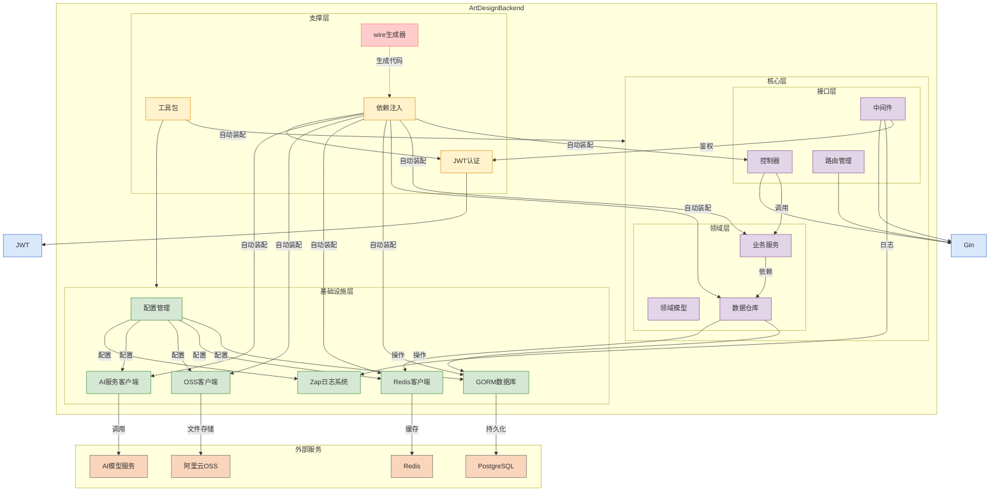

# Art-Design-Pro 个人后端项目

[前端项目地址](https://github.com/WwhdsOne/Art-Design-Frontend)

## 快速开始

### 环境要求
- Go 1.25+
- PostgreSQL
- Redis
- Consul（配置中心）

### 安装依赖
```bash
go mod download
```

### 安装开发工具
```bash
make install-tools
```

### 安装 Git Hooks
```bash
go get -tool github.com/evilmartians/lefthook@latest
./scripts/setup-lefthook.sh
```

### 运行项目
```bash
# 1. 配置 Consul（详见下方"配置说明"章节）
# 2. 生成依赖注入代码
make wire

# 3. 构建并运行
make build
./bin/art-design-backend
```

## 配置说明

### 配置方式
本项目使用 **Consul** 作为配置中心，配置文件位于 `configs/` 目录。

### 配置示例
**完整配置文件：** [config.example.yaml](./configs/config.example.yaml)

**关键配置项示例：**
```yaml
server:
  port: ":8888"
  read-timeout: "300s"
  write-timeout: "300s"

postgre_sql:
  host: "localhost"
  port: 5432
  user: "postgres"
  password: "your-postgres-password"  # 请修改
  database: "Art-Design-Backend"

redis:
  host: "localhost"
  port: 6379
  password: "your-redis-password"      # 请修改

jwt:
  signing-key: "your-jwt-signing-key-here"  # 请修改
  expires-time: "1d"
  issuer: "Wwhds"
  audience: "Art-Design-User"
```

**详细配置说明：** 查看 [config.example.yaml](./configs/config.example.yaml) 获取所有配置项的详细说明。

### 敏感信息处理
以下配置项包含敏感信息，请勿提交到版本控制：
- PostgreSQL 密码
- Redis 密码
- JWT 签名密钥
- OSS 访问密钥和配置
- API 密钥

**安全建议：**
1. 使用环境变量或密钥管理服务存储敏感信息
2. 不同环境使用不同的配置（dev/test/prod）
3. 定期轮换密钥
4. 限制配置文件的访问权限

### 开发环境配置
开发环境可以使用本地 YAML 文件，但不要提交到 Git。

**推荐配置文件：**
```
configs/
├── config.example.yaml  # 配置示例（提交到版本控制）
└── dev.yaml            # 开发环境配置（不提交到版本控制）
```

### Consul 配置
**上传配置到 Consul：**
```bash
# 1. 启动 Consul
docker run -d -p 8500:8500 consul

# 2. 访问 Consul UI
open http://localhost:8500

# 3. 上传配置
# 使用 Consul UI 或 API 上传 YAML 配置
# Key: art-design-backend
# Value: YAML 配置内容（参考 config.example.yaml）
```

**设置环境变量：**
```bash
export CONSUL_ADDR=localhost:8500
export CONSUL_CONFIG_KEY=art-design-backend
```

**项目启动时自动从 Consul 加载配置。**

## 开发指南

### 代码规范
本项目使用 [Revive](https://github.com/mgechev/revive) 进行代码检查。

**运行检查：**
```bash
make lint
```

**配置文件：** `revive.toml`

### Git Hooks
本项目使用 [Lefthook](https://github.com/evilmartians/lefthook) 管理 Git hooks。

**功能：**
- Pre-commit: wire → lint → test
- Commit-msg: 检查提交信息格式

**详细文档：** [LEFTHOOK.md](./docs/LEFTHOOK.md)

### 提交信息规范
符合 [Conventional Commits](https://www.conventionalcommits.org/) 规范。

**格式：**
```
<type>: <subject>
```

或

```
<type>(<scope>): <subject>
```

**允许的类型：**
- `feat` - 新功能
- `fix` - 修复 bug
- `docs` - 文档修改
- `style` - 格式（不影响代码逻辑）
- `refactor` - 重构
- `perf` - 性能优化
- `test` - 增加测试
- `chore` - 构建过程或辅助工具的变动

**示例：**
```bash
feat(auth): add JWT authentication
fix: resolve memory leak in user service
docs: update API documentation
refactor: simplify user service logic
```

### 常用命令
```bash
make help           # 查看所有命令
make wire           # 生成依赖注入代码
make lint           # 代码检查
make test           # 运行测试
make build          # 构建项目
make pre-commit     # 提交前检查
```

**详细文档：** [CODE_QUALITY.md](./docs/CODE_QUALITY.md)

# 项目结构

```shell
├── cmd                         # 应用程序入口目录（通常包含 main.go）
│   └── app                     # 具体的应用主程序
├── config                      # 配置加载逻辑（如初始化配置结构体等）
├── configs                     # 配置文件目录（如 .yaml、.json 等）
├── internal                    # 内部模块（按领域或功能划分）
│   ├── bootstrap               # 项目启动流程，如初始化数据库、日志、依赖注入等
│   ├── controller              # 控制器层（HTTP 接口逻辑）
│   ├── model                   # 模型定义层
│   │   ├── base                # 通用基础模型（如 BaseModel）
│   │   ├── entity              # 与数据库结构对应的实体定义
│   │   ├── query               # 查询结构体定义（用于参数组合、查询构造）
│   │   ├── request             # 接收前端请求的结构体
│   │   └── response            # 返回给前端的响应结构体
│   ├── repository              # 仓储层（数据访问逻辑）
│   │   ├── cache               # 缓存访问逻辑（通常是 Redis）
│   │   └── db                  # 数据库访问逻辑（通常是 GORM/SQL）
│   └── service                 # 服务层（业务逻辑实现）
 ├── pkg                         # 可复用的通用模块（第三方或自研工具）
 │   ├── ai                      # AI 模块（如模型推理、调用接口）
 │   ├── aliyun                 # 阿里云 SDK 封装（如短信、OSS）
 │   ├── authutils               # 鉴权工具包
 │   ├── constant                # 常量定义
 │   │   ├── prompt              # AI 提示词模板
 │   │   ├── rediskey            # Redis 键名常量
 │   │   └── tablename           # 表名常量
 │   ├── digit_client            # 数字识别客户端（如识图接口等）
 │   ├── errors                  # 自定义错误类型
 │   ├── jwt                     # JWT 生成与解析
 │   ├── middleware              # Gin 中间件集合
 │   ├── redisx                  # Redis 封装（连接池、通用方法）
 │   ├── result                  # 通用响应结构体（如统一的 Response 封装）
 │   └── utils                   # 工具函数（如字符串处理、时间格式化等）
 ├── scripts                     # 启动脚本、部署脚本、数据库初始化等
 ├── lefthook.yml               # Lefthook 配置（Git Hooks）
 ├── revive.toml                 # Revive 代码检查配置
 └── Makefile                    # 构建和检查任务
```

# 完整技术栈



# 注意事项

## 运行前准备

### 1. 配置 Consul
首次使用需要配置 Consul，详见上方"配置说明"章节。

### 2. 确保外部服务可用
- PostgreSQL（数据库）
- Redis（缓存）
- Consul（配置中心）
- 阿里云 OSS（文件存储，如需要）
- AI 模型服务（如需要）

### 3. 生成依赖注入代码
```bash
make wire
```

## 常见问题

### Q: Wire 生成失败
```bash
# 清理后重新生成
rm -rf cmd/app/wire_gen.go
make wire
```

### Q: Git Hooks 没有生效
```bash
# 重新安装 Lefthook hooks
./scripts/setup-lefthook.sh
```

### Q: 代码检查失败
```bash
# 查看详细错误
make lint
```

## 项目文档

- [代码质量检查体系](./docs/CODE_QUALITY.md)
- [Lefthook 使用指南](./docs/LEFTHOOK.md)

## License

[MIT](./LICENSE)

